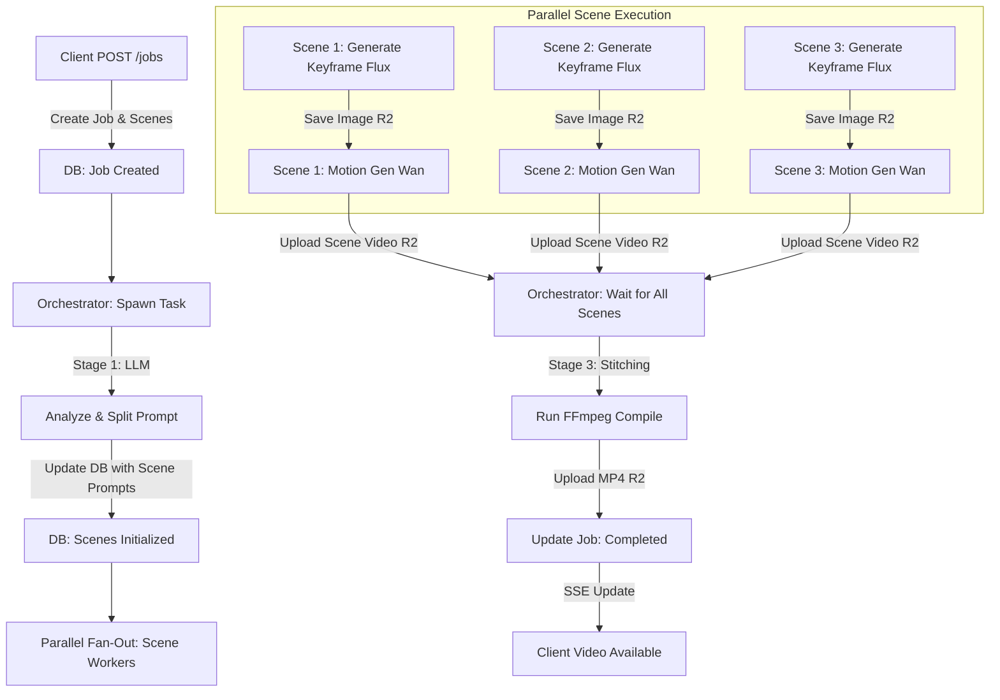

# NovaScene Backend Architecture Blueprint (Node.js & TypeScript)

The NovaScene backend is built using **Node.js & TypeScript**, acting as an asynchronous orchestrator. It manages the lifecycle of video generation jobs, queues tasks to Redis/BullMQ, updates the database, and streams status updates to the client in real time via Server-Sent Events (SSE).

---

## 1. Directory Structure

The backend application is organized to maintain a clean separation between API routes, workflow orchestration, database connection pooling, and external provider integrations.

```text
backend/
├── src/
│   ├── index.ts                  # Express server main entrypoint
│   ├── config.ts                 # Environment variables & configurations
│   ├── core/
│   │   ├── orchestrator.ts       # Job processing and stitching manager
│   │   ├── provider.ts           # Abstract GPU worker interface and mock provider
│   │   └── runpod_provider.ts    # Concrete RunPod endpoint API provider implementation
│   ├── db/
│   │   ├── connection.ts         # PostgreSQL node-pg client connection pool
│   │   └── models.ts             # Data mapping layers
│   └── types/
│       └── index.ts              # Core TypeScript interfaces (Job, Scene)
├── package.json                  # Dependencies configuration
├── tsconfig.json                 # TypeScript compiler options
├── db/
│   └── schema.sql                # Raw SQL DDL schema script
└── tests/
    └── orchestration.test.ts     # Jest / Supertest integration checks
```

---

## 2. Authentication Bypass Policy (Skipped for Now)

Following the project requirements, **user authentication has been skipped**.
- All jobs are associated with a default system user or treated as anonymous projects.
- The API endpoints do not require headers like `Authorization: Bearer <token>` for this phase.
- The database schema still includes a lightweight `users` table to maintain standard foreign keys, but writes will default to a seed tenant user ID `00000000-0000-0000-0000-000000000000`.

---

## 3. Job Orchestration Flow

Below is the state machine representation of how a video job proceeds from prompt to final compilation.



---

## 4. Real-time Status via Server-Sent Events (SSE)

Clients listen to a persistent connection on `GET /api/v1/jobs/:job_id/stream`.
The Express server sets keep-alive headers, records client responses in memory, and writes update blocks whenever jobs or scene segments transition states.

### Event Format

```text
event: progress
data: {"job_id": "job_123", "status": "processing_scenes", "overall_progress": 45, "scenes": [...], "video": null}

event: progress
data: {"job_id": "job_123", "status": "completed", "overall_progress": 100, "scenes": [...], "video": {"videoUrl": "...", "thumbnailUrl": "..."}}
```

---

## 5. Cost-Optimized Caching Strategy

To minimize Cloud GPU worker execution and reduce billing:
1. **Scene Prompt Caching**: Prior to queueing Flux keyframe generation, a hash of the clean scene prompt is searched in the database (`scenes` table). If a match is found with an identical prompt and configuration, the backend copies the existing `image_url` and `video_url` directly instead of scheduling a new GPU execution.
2. **Ephemeral GPU Lifecycle**: The worker logic specifies job polling from Redis queue. If the queue is empty for longer than 300 seconds, the worker reports idle state to the scaling engine to initiate safe shutdown.
