# NovaScene GPU Worker Infrastructure & RunPod Integration

NovaScene uses stateless GPU workers to run model inferences for image generation (Flux 1.2.1) and motion generation (Wan 2.1 / AnimateDiff). These workers scale horizontally based on queue backlogs.

---

## 1. Provider Abstraction Layer (TypeScript)

To ensure vendor independence (allowing transitions between RunPod, Modal, Replicate, or local clusters), we define a provider interface in the API orchestration layer.

```typescript
// backend/src/core/provider.ts

export interface VideoProvider {
  /**
   * Submits a job to the Flux 1.2.1 keyframe generation worker.
   * Returns the public R2 URL of the generated image.
   */
  generateImage(prompt: string, aspectRatio: string, options?: Record<string, any>): Promise<string>;

  /**
   * Submits the keyframe and prompt to the Wan 2.1 motion generation worker.
   * Returns the public R2 URL of the final compiled video scene.
   */
  generateMotion(imageUrl: string, prompt: string, duration: number, options?: Record<string, any>): Promise<string>;
}
```

---

## 2. RunPod Provider Integration Architecture

For the RunPod implementation, the backend communicates with a **RunPod Serverless Endpoint** or queries worker instances via custom REST requests.

```mermaid
sequenceDiagram
    participant API as Node.js Orchestrator
    participant RP as RunPod API Gateway
    participant GW as RunPod GPU Worker Container
    participant R2 as Cloudflare R2 Bucket

    API->>RP: POST /v1/run/{endpoint_id} (payload: prompt, aspect_ratio)
    RP-->>API: 202 Accepted (id: job_abc)
    
    rect rgb(30, 20, 40)
        Note over GW: Cold-start / Active state check
        GW->>RP: Pull task (job_abc)
        Note over GW: Run Flux 1.2.1 / Wan 2.1 inference
        GW->>R2: Upload output asset (.jpg or .mp4)
        GW->>RP: Mark Completed (status: success, output: r2_key)
    end
    
    loop Poll/Webhook Status
        API->>RP: GET /v1/status/{job_abc}
        RP-->>API: status: COMPLETED, output: r2_key
    end
```



---

## 3. Stateless Worker Lifecycle

RunPod workers are packaged as Docker containers containing PyTorch, Hugging Face Hub downloads, and custom inference scripts. They remain completely stateless.

### Worker Event Loop Steps
1. **Initialize**: On container launch, download and cache the weight files locally (Flux 1.2.1 / Wan 2.1 weights) to a persistent cache volume (`/runpod-volume`) to avoid downloading weights on every cold-start.
2. **Retrieve Job**: Poll task parameters from the RunPod Serverless trigger.
3. **Execute Model pipeline**:
   - **Flux (Keyframe)**: Load latent text encoder, execute diffusion scheduler, and output high-res raw image tensor.
   - **Wan 2.1 (Motion)**: Load keyframe image, resize to target aspect ratio, pass to image-to-video (I2V) cross-attention block, run temporal-consistent denoising, and compile frames into an MP4 clip.
4. **Upload Asset**: Stream generated binary directly to Cloudflare R2 using AWS-SDK compatible credentials loaded into the worker’s environment variables.
5. **Publish Progress**: Write status logs (e.g. `[Flux] Denoising: 40%`) back to the job stream.
6. **Graceful Exit**: On empty queue timeout (e.g. 5 minutes), the RunPod autoscaling rules scale the container counts down to zero.

---

## 4. Error Mitigation: CUDA Out-Of-Memory (OOM)

If an inference task encounters a CUDA OOM error, the worker:
1. Performs a `torch.cuda.empty_cache()` clean-up operation.
2. Reports an error payload containing `error_code: CUDA_OOM` back to the orchestrator.
3. The orchestrator receives the code and automatically schedules a retry to a new worker pod with a higher VRAM profile (e.g., transitions from RTX 4090 with 24GB to A100 with 80GB VRAM) or reduces the batch size configuration.
