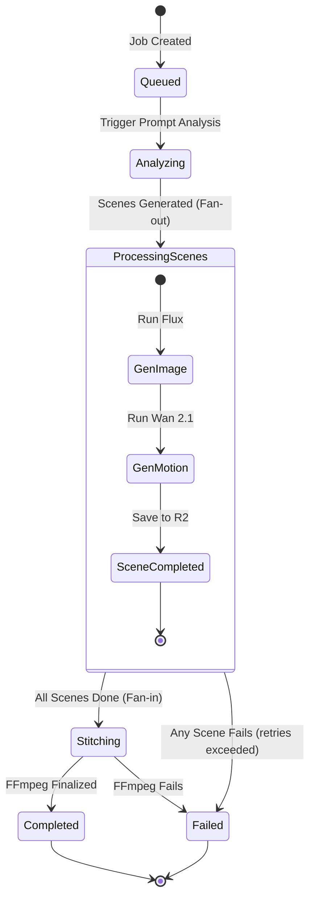

# NovaScene Workflow Engine & Queue Design (BullMQ & Redis)

NovaScene relies on decoupled, asynchronous execution. Web requests do not block while rendering. Instead, they place tasks onto dedicated queues managed by **Redis & BullMQ**.

---

## 1. Queue Architecture

To prevent bottlenecks, workloads are divided into distinct queues based on computing resources.

| Queue Name | Node Type | Job Description | Scaling Factor |
| :--- | :--- | :--- | :--- |
| `prompt-analysis` | CPU Worker | Split prompt into scenes using lightweight LLM | Low scale (seconds) |
| `image-generation` | GPU Worker | Run Flux 1.2.1 text-to-image keyframes | High scale (parallel) |
| `motion-generation`| GPU Worker | Run Wan 2.1 or AnimateDiff video models | High scale (parallel) |
| `video-stitching` | CPU Worker | Download clips, merge with FFmpeg | Medium scale |
| `asset-cleanup` | CPU Worker | Handle orphaned R2 assets, retention policy | Low scale (cron) |

---

## 2. Distributed State Machine



---

## 3. Asynchronous Orchestration Logic in TypeScript

The orchestrator utilizes **Task Fan-Out** via `Promise.all` to trigger parallel generations for all parsed scenes. This ensures that for a 3-scene video, all keyframes and motion clips render concurrently across available RunPod nodes, bringing rendering times down.

### TypeScript / Node.js Fan-Out Implementation Model

```typescript
// backend/src/core/orchestrator.ts
import { VideoProvider } from './provider';

interface Scene {
  sceneIndex: number;
  duration: number;
  prompt: string;
}

export class NovaSceneOrchestrator {
  constructor(private provider: VideoProvider) {}

  async executeJob(jobId: string, prompt: string): Promise<string> {
    // 1. Analyze prompt to split into sub-scene instructions
    const scenes = await this.splitPromptIntoScenes(prompt);
    
    // 2. Parallel Fan-out: Await parallel GPU task completion
    const renderingTasks = scenes.map(async (scene) => {
      // Step A: Generate keyframe image via Flux
      const imageUrl = await this.provider.generateImage(scene.prompt, "16:9");
      
      // Step B: Generate motion video clip via Wan 2.1
      const videoUrl = await this.provider.generateMotion(imageUrl, scene.prompt, scene.duration);
      
      return videoUrl;
    });

    const sceneClips = await Promise.all(renderingTasks);
    
    // 3. Fan-in: Stitch compiled clips with FFmpeg pipeline
    const finalVideoUrl = await this.stitchScenes(sceneClips);
    return finalVideoUrl;
  }
}
```

---

## 4. Retries and Fault Tolerance in BullMQ
1. **BullMQ Retry Settings**: Inference tasks are defined with backoff policies:
   ```typescript
   await queue.add('flux-task', taskData, {
     attempts: 3,
     backoff: {
       type: 'exponential',
       delay: 5000 // retry in 5s, 10s, 20s
     }
   });
   ```
2. **Idempotent Job IDs**: BullMQ uses unique `jobId` hashes. If a worker fails, enqueuing a task with the same `jobId` does not recreate it, ensuring deduplication.
3. **Scene-Only Recovery**: If a job fails at the stitching phase, re-submitting it checks the scene table cache in PostgreSQL. The orchestrator reuses the cached scene media files, only scheduling tasks for scenes that did not successfully compile, saving computational GPU time.
